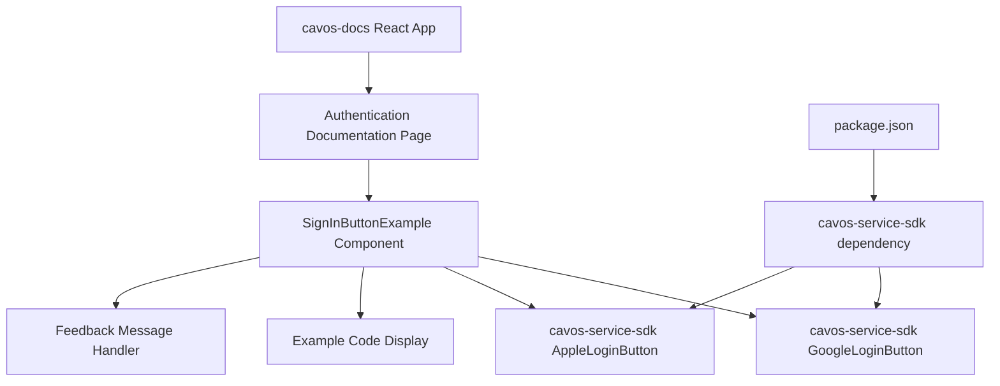

# Design Document

## Overview

The design integrates cavos-service-sdk's Google and Apple sign-in buttons directly into the cavos-docs React application. The approach leverages the existing documentation architecture while adding minimal dependencies. The buttons will be embedded as interactive examples within the authentication documentation pages, using a simple wrapper component that handles the documentation-specific context and provides appropriate user feedback.

## Architecture



The design maintains separation between the documentation presentation layer and the actual SDK components, allowing for easy updates to either system without affecting the other.

## Components and Interfaces

### SignInButtonExample Component
```typescript
interface SignInButtonExampleProps {
  type: 'google' | 'apple'
  title: string
  description?: string
  showCode?: boolean
}
```

This wrapper component will:
- Render the appropriate SDK button
- Display corresponding code examples
- Handle documentation-specific error states
- Provide consistent styling within the docs theme

### Documentation Integration Points
- **Authentication Guide Page**: Primary location for button examples
- **SDK Documentation Pages**: Secondary examples showing integration patterns
- **Quick Start Guide**: Simplified examples for getting started

### SDK Integration Interface
```typescript
// Minimal configuration approach
const exampleConfig = {
  orgToken: 'demo-token', // Non-functional demo token
  network: 'sepolia',
  finalRedirectUri: window.location.origin + '/auth/demo'
}
```

## Data Models

### Button Example Configuration
```typescript
interface ButtonExampleConfig {
  orgToken: string      // Demo/placeholder token
  network: 'sepolia'    // Fixed to testnet for docs
  onSuccess?: (result: any) => void
  onError?: (error: any) => void
  finalRedirectUri: string
}
```

### Documentation Context
```typescript
interface DocsContext {
  isDemoMode: true      // Always true in documentation
  showCodeExamples: boolean
  currentSection: string
}
```

## Error Handling

### Authentication Flow Limitations
- **Demo Token Usage**: Buttons will use non-functional demo tokens that trigger appropriate "documentation mode" messaging
- **Redirect Handling**: Failed authentications redirect to a demo success page explaining the documentation context
- **Network Timeouts**: Graceful handling of network issues with clear user feedback

### Error Categories
1. **Expected Documentation Errors**: Authentication failures due to demo tokens - handled with informational messages
2. **Configuration Errors**: Invalid props or missing dependencies - handled with developer-focused error messages
3. **Network Errors**: Connection issues - handled with retry suggestions and fallback content

## Testing Strategy

### Component Testing
- Unit tests for SignInButtonExample wrapper component
- Integration tests verifying SDK button rendering
- Props validation testing for different configuration scenarios

### Documentation Integration Testing
- Visual regression testing to ensure consistent documentation styling
- Cross-page navigation testing to verify examples don't break routing
- Mobile responsiveness testing for button examples

### Error Scenario Testing
- Test demo token authentication flows
- Test network failure scenarios
- Test invalid configuration handling

### Build Integration Testing
- Verify cavos-service-sdk dependency resolution
- Test build process with new SDK dependency
- Validate bundle size impact assessment

The design prioritizes simplicity and developer experience while maintaining the existing documentation site's performance and usability. All examples will be clearly marked as demonstration versions with links to full implementation guides.